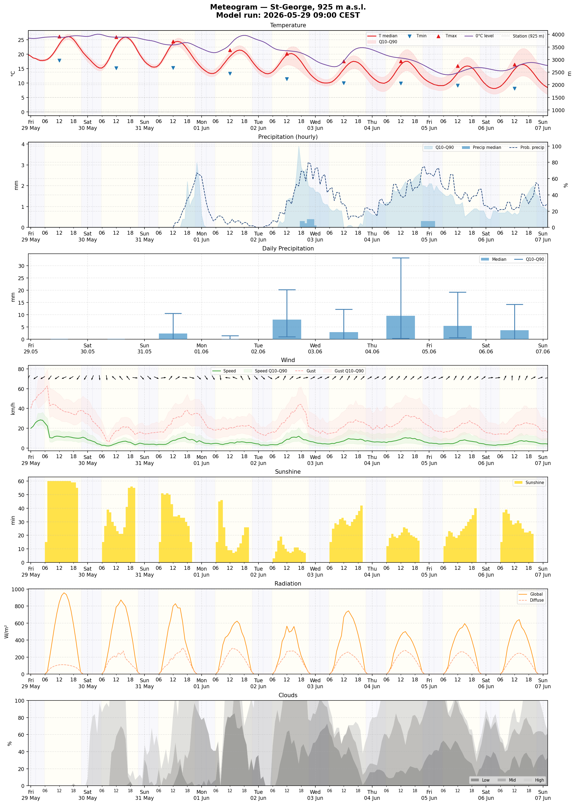
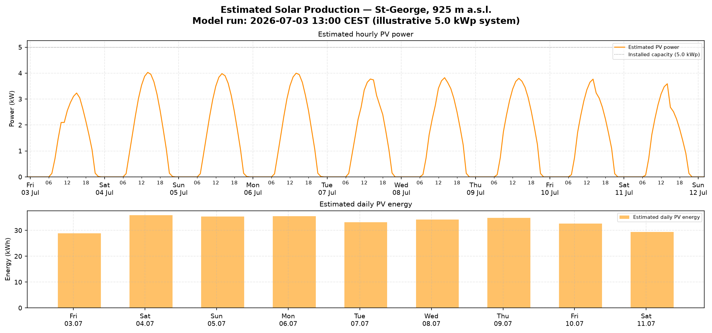

## 🌤️ MeteoSwiss Open Data: Local Forecast Demos

[](https://opensource.org/licenses/BSD-3-Clause)

This repository provides Jupyter notebook examples for accessing and visualizing local weather forecasts from MeteoSwiss, released through Switzerland's **Open Government Data (OGD)** initiative.

Access high-resolution forecasts for **~5,600 points** across Switzerland — including weather stations, towns, and postal code areas (PLZ).

---

## 🌤️ The Meteogram Notebook

`notebooks/Meteogram.ipynb` walks you through the full workflow of accessing MeteoSwiss OGD forecast data, from location discovery to visualization. It is structured as a story with one concept per section:

| Section | What you learn |
|---|---|
| 1 · Choose your location | How forecast data is organised by point of interest (POI) |
| 2 · Explore parameters | What MeteoSwiss publishes and how parameters are grouped |
| 3 · Download the data | How to query the STAC API and parse the CSV files |
| 4 · Visualise | How to render a 9-day meteogram |
| 5 · Daily summary | How pictogram codes map to weather descriptions |

**Key features:**
- **Integrated POI search** — find your location by name or ZIP code directly in the notebook
- **9-day forecast horizon** — hourly data combined with daily summaries
- **Metadata-driven** — units, labels, and panel groupings resolved automatically from OGD metadata
- **Accurate day/night shading** — sunrise and sunset computed per location using astronomical calculations

### What the meteogram shows

The chart is divided into up to six panels, each covering a different aspect of the forecast:

| Panel | What is shown |
|---|---|
| **Temperature** | Hourly median temperature at 2 m (°C) with a Q10–Q90 uncertainty band; daily minimum and maximum markers; freezing-level altitude (m a.s.l.) on a secondary axis |
| **Precipitation (hourly)** | Hourly precipitation amounts (mm) as bars with a Q10–Q90 uncertainty band; precipitation probability (%) as a dashed line on a secondary axis |
| **Precipitation (daily)** | Daily total precipitation (mm) as bars with Q10–Q90 whiskers |
| **Wind** | 10-minute mean wind speed and gusts (km/h) with Q10–Q90 uncertainty bands; wind direction shown as arrows every 3 hours |
| **Sunshine** | Hourly sunshine duration (min) |
| **Radiation** | Global and diffuse solar radiation (W/m²) |
| **Clouds** | Low, mid, and high cloud cover (%) as a stacked area chart |

All hourly panels share the same time axis with day/night shading. You can display any subset of panels by setting `PANELS = ["Temperature", "Wind"]` in the configuration cell.

The plotting code lives in `meteogram_plot.py`, alongside the notebook. The notebook itself focuses on the data and the API; open the module only if you want to customise the chart.



**Daily Weather Summary Table (example output):**

| Date      | Weather                            | T min (°C) | T max (°C) | Precip. (mm) |
|-----------|------------------------------------|------------|------------|--------------|
| Mon 19.05 | partly sunny, thick passing clouds | 12.3       | 22.1       | 0–2          |
| Tue 20.05 | very cloudy, light rain            | 10.8       | 19.5       | 3–15         |
| Wed 21.05 | high clouds                        | 11.1       | 21.3       | 0            |
| Thu 22.05 | mostly sunny, some clouds          | 12.5       | 23.0       | 0            |
| Fri 23.05 | overcast, some rain showers        | 11.0       | 18.7       | 5–20         |
| Sat 24.05 | sunny                              | 10.2       | 24.1       | 0            |
| Sun 25.05 | mostly sunny, some clouds          | 11.8       | 25.3       | 0            |
| Mon 26.05 | partly sunny, thick passing clouds | 12.0       | 22.8       | 0–3          |
| Tue 27.05 | mostly sunny, some clouds          | 13.0       | 24.2       | 0            |

---

## ☀️ The Solar Production Notebook

`notebooks/SolarProduction.ipynb` shows a practical downstream use case for the same OGD data: estimating expected PV (solar panel) output from the 9-day global radiation forecast. It reuses the fetch/parse pipeline from the Meteogram notebook, then feeds `gre000h0` into a simple physical model — `power = capacity_kwp × (radiation / 1000) × derate_factor` — for an illustrative rooftop system.

**Note:** this is a deliberately simple, illustrative model (no panel tilt/orientation, temperature derating, or shading) meant to demonstrate how OGD forecast data can feed a downstream model — not a calibrated PV yield tool. For production-grade PV forecasting, consider [`pvlib`](https://pvlib-python.readthedocs.io/).

The plotting code lives in `notebooks/solar_plot.py`, following the same notebook/plotting-module split as the Meteogram demo.



---

## 🚀 Quick Start

### Try it instantly — no installation needed

[](https://renkulab.io/p/meteoswiss/opendata-local-weatherforecast-demo/sessions/01KSM0G2KFE1DJWQ35E72EXV4C/start)

Click the badge above to open the notebook in a ready-to-use cloud environment. Once the session has started (1–2 minutes):

1. In the file browser on the left, navigate to `opendata-local-weatherforecast-demos/notebooks/`
2. Open `Meteogram.ipynb` (or `SolarProduction.ipynb` for the PV output demo)
3. Run all cells: **Run → Run All Cells**

### Using the notebook

1. **Find your location** — use the interactive search table in section 1 to find your town (e.g. `"Zermatt"` or `"8001"`) and copy the `point_id`
2. **Set your POI** — paste the `point_id` into the configuration cell
3. **Run all cells**

To customise the output, edit the configuration cell:
- `PANELS = ["Temperature", "Wind"]` — show only selected panels
- `LANG = "de"` — switch labels to German, French, or Italian

---

## 🛠️ Technical Details

### Data source
Forecast data is fetched directly from the [Federal Geodata Infrastructure STAC API](https://data.geo.admin.ch/api/stac/v1).

- **Collection:** `ch.meteoschweiz.ogd-local-forecasting`
- **Update cycle:** Updated hourly
- **Horizon:** 9 days (D+0 to D+8)

### Repository structure

```
notebooks/
  Meteogram.ipynb       # Main notebook — data access and API walkthrough
  meteogram_plot.py     # Plotting module — all matplotlib code lives here
  SolarProduction.ipynb # Downstream demo — PV output estimate from the radiation forecast
  solar_plot.py         # Plotting module for the Solar Production notebook
```

### Architecture

The notebook is **metadata-driven**: it reads the [OGD parameter CSV](https://data.geo.admin.ch/ch.meteoschweiz.ogd-local-forecasting/ogd-local-forecasting_meta_parameters.csv) at runtime to resolve parameter units, panel groupings, and hourly vs. daily granularity — no hardcoded labels.

The plotting module (`meteogram_plot.py`) is intentionally separate so the notebook stays focused on explaining the data. It exposes a single entry point:

```python
from meteogram_plot import plot_meteogram
plot_meteogram(df_hourly, df_daily, ...)
```

---

## 💻 Local Installation

```bash
git clone https://github.com/MeteoSwiss/opendata-localforecast-demos.git
cd opendata-localforecast-demos
python3 -m venv .venv
source .venv/bin/activate        # Windows: .venv\Scripts\activate
pip install poetry
poetry install
poetry run jupyter lab
```
